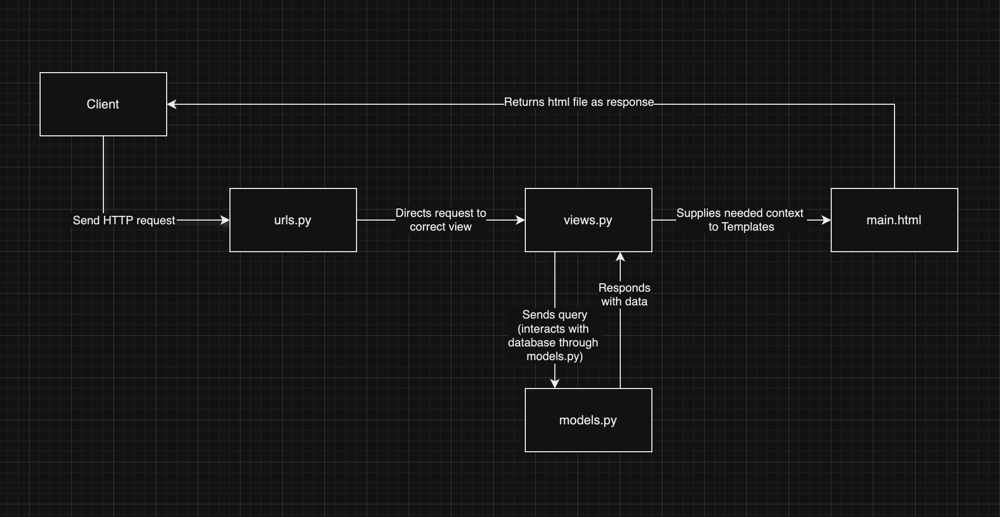

# Welcome to Grady!
Link to PWS deployement: [Grady](https://gunata-prajna-grady.pbp.cs.ui.ac.id/)  
By Gunata Prajna Putra Sakri - 2406453461  
Platform Based Programming KKI 2025/2026

<details>
<Summary><b>Assignment 2</b></summary>

## Step-by-Step Project Implementation
A breakdown of what I did to execute this project:
### Creating the Django project
1. I made a new directory "grady_shop" to store the contents of this project
2. I installed a virtual environment in the "grady" directory by running this command on the terminal:
    ```
   python3 -m venv env
   ```
3. Then I activated it with the command:
    ```
   source env/bin/activate
   ```
4. I created the file "requirement.txt" and edited it by using VS Code to add the required the dependencies:
   ```
   django
   gunicorn
   whitenoise
   psycopg2-binary
   requests
   urllib3
   ```
5. Then I installed the dependencies with the command:
    ```
    pip install -r requirements.txt
    ```
6. I created a new Django project named "grady" with the command 
    ```
    django-admin startproject grady.
    ```
7. After the project was installed, I added "localhost" and "127.0.0.1" to the ALLOWED_HOSTS in the settings.py file.

### Creating an application with the name main in the project.
8. I created a new application named main with the command:
    ```
    python manage.py startapp main
    ```
9. After the main application was installed, I added 'main' to the INSTALLED_APPS list in the settings.py file to signify the presence of the main application.

### Creating a Template
10. To create a template, I created a templates directory (within the main directory) and added a main.html file that would serve as the template.
11. I filled the template with the necessary components (application name, name, class)

### Creating Models
12. I added a model in the models.py file called Product, which has the necessary attributes name, price, and description, and i also added other attributes that relate to my shop, namely release_date and genre.
13. I then performed migrations to apply my model with the commands:
    ```
    python3 manage.py makemigrations
    python3 manage.py migrate
    ```

### Connecting View with Template
14. I filled the views.py file with a function called show_main that will "send" data to the template if a request is made from the template, which includes app_name, name, and class.

### Configuring URLs
15. I created a urls.py file in the main application and added the following code to configure the routing in the application:
    ```
    from django.urls import path
    from main.views import show_main

    app_name = 'main'

    urlpatterns = [
        path('', show_main, name='show_main'),
    ]
    ```
16. Then, I edited the urls.py in the grady_shop project for overall project with:
    ```
    from django.urls import path, include

    urlpatterns = [
        path('', include('main.urls')),
    ]
    ```

### Git and PWS Deployment
17. I created a new repository on GitHub and connected it to the local repository by runnning git init.
18. After the connection was established, I performed add, commit, and push actions to the remote GitHub repository.
19. To deploy to PWS, I created a new project titled 'grady' on the PWS website then added my PWS deployement URL to the ALLOWED_HOSTS list in settings.py.
20. Finally, I connected the repository to PWS and pushed it to the PWS repository for deployment.
21. I'm finished!


## Diagram


## Role of `settings.py`
Basically, `settings.py` is like the control center of a Django project. Everything important is configured there: the database, which apps are installed, where the templates and static files are, security keys, debug mode, allowed hosts, etc. Without it, Django won’t know how to run your project.  

---

## How Database Migration Works
Whenever we make or change a model in `models.py`, Django needs to update the database so it matches. That’s where migration comes in:  
1. `makemigrations` → Django creates migration files that describe the changes.  
2. `migrate` → applies those changes to the actual database.  

So it’s like version control, but for the database structure. Super useful when working in teams.  

---

## Why Django as a Starting Point?
Django is a good first framework because it already has a lot of stuff built in (auth, admin, ORM, etc.), so you don’t need to reinvent the wheel. It also forces you to write clean and structured code with the MVT pattern, which helps beginners understand how web apps are organized. Plus, it’s used in real-world apps, has great docs, and once you get Django, learning other frameworks feels way easier.  
