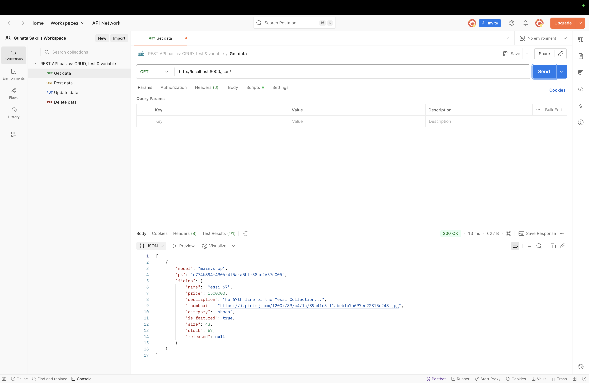
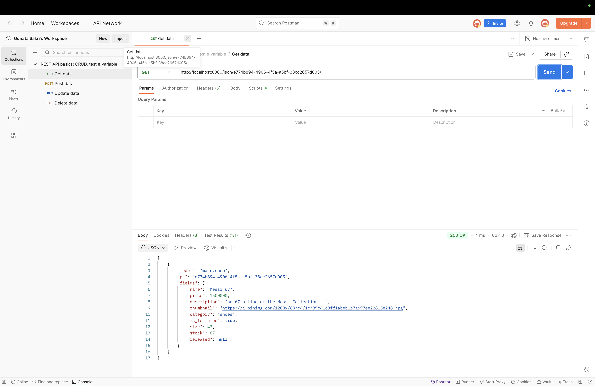
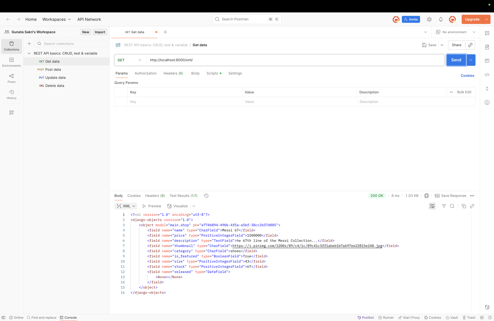
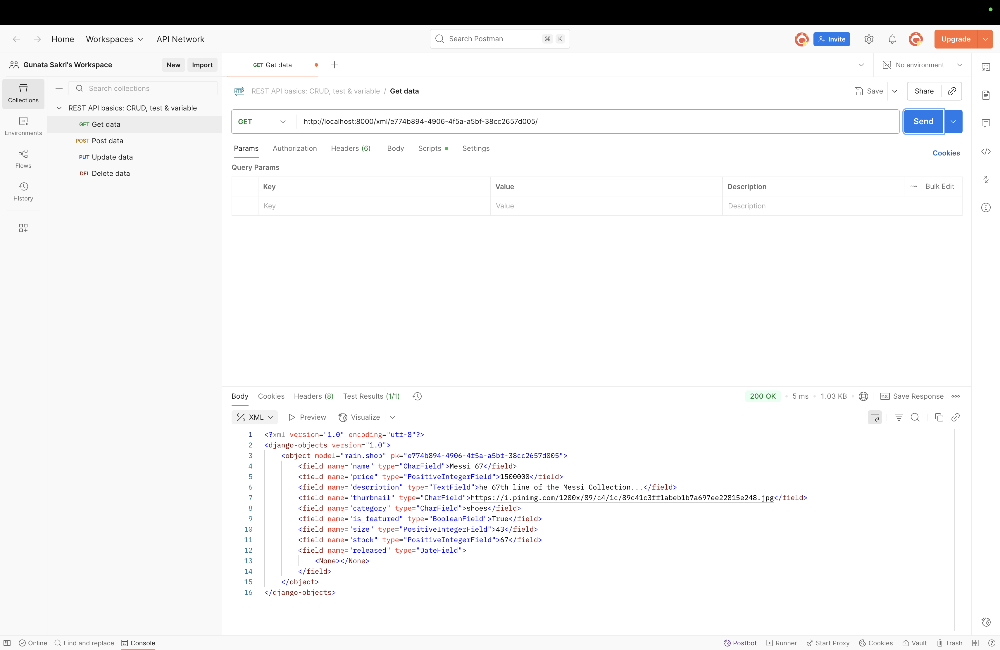
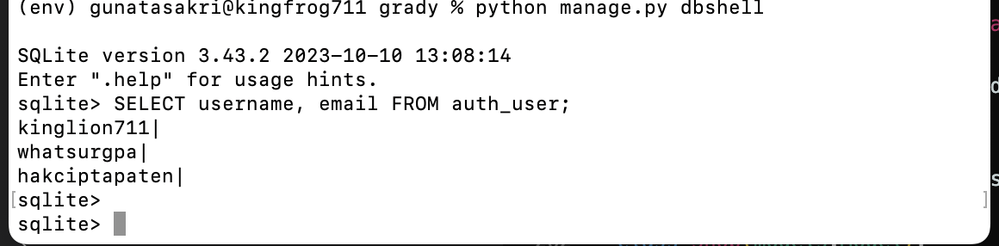

# Welcome to Grady!
Link to PWS deployement: [Grady](https://gunata-prajna-grady.pbp.cs.ui.ac.id/)  
By Gunata Prajna Putra Sakri - 2406453461  
Platform Based Programming KKI 2025/2026

<details>
<Summary><b>Assignment 2</b></summary>

## Step-by-Step Project Implementation
A breakdown of what I did to execute this project:
### Creating the Django project
1. I made a new directory "grady_shop" to store the contents of this project
2. I installed a virtual environment in the "grady" directory by running this command on the terminal:
    ```
   python3 -m venv env
   ```
3. Then I activated it with the command:
    ```
   source env/bin/activate
   ```
4. I created the file "requirement.txt" and edited it by using VS Code to add the required the dependencies:
   ```
   django
   gunicorn
   whitenoise
   psycopg2-binary
   requests
   urllib3
   ```
5. Then I installed the dependencies with the command:
    ```
    pip install -r requirements.txt
    ```
6. I created a new Django project named "grady" with the command 
    ```
    django-admin startproject grady.
    ```
7. After the project was installed, I added "localhost" and "127.0.0.1" to the ALLOWED_HOSTS in the settings.py file.

### Creating an application with the name main in the project.
8. I created a new application named main with the command:
    ```
    python manage.py startapp main
    ```
9. After the main application was installed, I added 'main' to the INSTALLED_APPS list in the settings.py file to signify the presence of the main application.

### Creating a Template
10. To create a template, I created a templates directory (within the main directory) and added a main.html file that would serve as the template.
11. I filled the template with the necessary components (application name, name, class)

### Creating Models
12. I added a model in the models.py file called Product, which has the necessary attributes name, price, and description, and i also added other attributes that relate to my shop, namely release_date and genre.
13. I then performed migrations to apply my model with the commands:
    ```
    python3 manage.py makemigrations
    python3 manage.py migrate
    ```

### Connecting View with Template
14. I filled the views.py file with a function called show_main that will "send" data to the template if a request is made from the template, which includes app_name, name, and class.

### Configuring URLs
15. I created a urls.py file in the main application and added the following code to configure the routing in the application:
    ```
    from django.urls import path
    from main.views import show_main

    app_name = 'main'

    urlpatterns = [
        path('', show_main, name='show_main'),
    ]
    ```
16. Then, I edited the urls.py in the grady_shop project for overall project with:
    ```
    from django.urls import path, include

    urlpatterns = [
        path('', include('main.urls')),
    ]
    ```

### Git and PWS Deployment
17. I created a new repository on GitHub and connected it to the local repository by runnning git init.
18. After the connection was established, I performed add, commit, and push actions to the remote GitHub repository.
19. To deploy to PWS, I created a new project titled 'grady' on the PWS website then added my PWS deployement URL to the ALLOWED_HOSTS list in settings.py.
20. Finally, I connected the repository to PWS and pushed it to the PWS repository for deployment.
21. I'm finished!


## Diagram


## Role of `settings.py`
Basically, `settings.py` is like the control center of a Django project. Everything important is configured there: the database, which apps are installed, where the templates and static files are, security keys, debug mode, allowed hosts, etc. Without it, Django won’t know how to run your project.  

---

## How Database Migration Works
Whenever we make or change a model in `models.py`, Django needs to update the database so it matches. That’s where migration comes in:  
1. `makemigrations` → Django creates migration files that describe the changes.  
2. `migrate` → applies those changes to the actual database.  

So it’s like version control, but for the database structure. Super useful when working in teams.  

---

## Why Django as a Starting Point?
Django is a good first framework because it already has a lot of stuff built in (auth, admin, ORM, etc.), so you don’t need to reinvent the wheel. It also forces you to write clean and structured code with the MVT pattern, which helps beginners understand how web apps are organized. Plus, it’s used in real-world apps, has great docs, and once you get Django, learning other frameworks feels way easier.  


</details>


<details>
<summary><b>Assignment 3</b></summary>

### 1. Why do we need data delivery?
So platforms can share and show data between users, apps, or systems. Without it, apps just stay isolated.

### 2. XML vs JSON  
JSON is simpler, easier to read/write, and works well with JS. XML is heavier. That’s why JSON is more popular.

### 3. What’s the purpose of `is_valid()` in Django forms?  
To check if the form input is valid before saving it. Avoids bad or incomplete data.

### 4. Why do we need `csrf_token` in Django forms?  
It protects against CSRF attacks. Without it, attackers could trick users into sending fake requests (like buying items, changing settings, etc.).

### 5. How I implemented it  
- Made `Shop` model with fields (name, price, etc.).
    and then ran
    ```
    python manage.py makemigrations
    python manage.py migrate
    ```

    to migrate all model changes


- Created `ShopForm` to add new products.  
    ```
    class ShopForm(ModelForm):
    class Meta:
        model = Shop
        fields = ["name","price","description","thumbnail","category","is_featured","size","stock","released"]
    ```


- Built views: publish product, show list, show detail, plus XML/JSON endpoints.  
    "they're all in the application folders"


- Made templates: home page, product detail, publish form.  
    "can be seen in the application folder"

- Tested by adding products and checking the pages.
    "i looked at the url and used the id to check out the xml and json urls"

### 6. Feedback  
The assignments are good, I just wish the tutorial would explain further on the technical side and be explained instead of just laid out.


### Images






</details>


<details>
<Summary><b>Assignment 4</b></Summary>
# Django Authentication & Shop Application

## 1. What is Django’s AuthenticationForm?

`AuthenticationForm` is a built-in form in Django that handles user login by validating the username and password against the database.

* **Advantages**: Secure (hashing + validation handled automatically), convenient, integrates seamlessly with Django’s authentication system.
* **Disadvantages**: Limited customization by default, harder to adapt for advanced login flows like email login or third-party authentication.

---

## 2. Authentication vs Authorization in Django

* **Authentication**: Confirms *who* the user is (identity check).
* **Authorization**: Determines *what* the user can do (permissions, access control).
* **In Django**:

  * Authentication handled by `django.contrib.auth` (forms, backends, middleware).
  * Authorization handled by groups, permissions, and decorators like `@login_required`.

---

## 3. Sessions vs Cookies

* **Sessions**:

  * ✅ Store data server-side → safer.
  * ❌ Uses server resources.
* **Cookies**:

  * ✅ Lightweight, fast.
  * ❌ Stored client-side → vulnerable if not secured.
* **Best practice**: Use sessions for sensitive info, cookies for simple preferences.

---

## 4. Are Cookies Secure by Default?

* Cookies are **not secure by default**. Risks include XSS (stealing cookies) and MITM attacks (intercepting if no HTTPS).
* **Django protections**:

  * `HttpOnly` flag prevents JavaScript access.
  * `Secure` flag ensures cookies only travel via HTTPS.
  * CSRF tokens for forms.
  * Developers can enforce:

    ```py
    SESSION_COOKIE_SECURE = True
    CSRF_COOKIE_SECURE = True
    ```

---

## 5. Implementation (Step-by-Step)

This is how I implemented the checklist for authentication and product (Shop) management.

### 5.1. Setup

```bash
source env/bin/activate
```

### 5.2. Register, Login, Logout

* Used `UserCreationForm` for registration, `AuthenticationForm` for login.
* Added messages for feedback (e.g., “Account created successfully”).
* Implemented `logout` view to clear cookies and redirect to login.

### 5.3. Login State with Cookies

* On login, stored a `last_login` cookie.
* Displayed in `main.html`:

```html
<h5>Last login session: {{ last_login }}</h5>
```

### 5.4. Shop Model (Product Management)

* Created a `Shop` model linked to `User`:

```py
from django.contrib.auth.models import User

class Shop(models.Model):
    id = models.UUIDField(primary_key=True, default=uuid.uuid4, editable=False)
    name = models.CharField(max_length=255)
    price = models.PositiveIntegerField(default=0)
    description = models.TextField()
    thumbnail = models.URLField(blank=True, null=True)
    category = models.CharField(max_length=20, choices=CATEGORY_CHOICES, default='update')
    is_featured = models.BooleanField(default=False)
    size =models.PositiveIntegerField(default=0)
    stock = models.PositiveIntegerField(default=0)
    released = models.DateField(blank=True, null=True)
```

* Ran `makemigrations` and `migrate` again.

### 5.5. Creating Products (linked to user)

* Modified create view so each product is linked to the logged-in user:

```py
def publish_product(request):
    form = ShopForm(request.POST or None)

    if form.is_valid() and request.method == "POST":
        shop_entry = form.save(commit = False)
        shop_entry.user = request.user
        shop_entry.save()
        return redirect('main:show_main')

    context = {'form': form}
    return render(request, "publish_product.html", context)
```

### 5.6. Filtering Products

* Added filter in `show_main`:

```py
filter_type = request.GET.get("filter", "all")
if filter_type == "all":
    shop_list = Shop.objects.all()
else:
    shop_list = Shop.objects.filter(user=request.user)
```

* Buttons in template:

```html
<a href="?filter=all"><button>All Products</button></a>
<a href="?filter=my"><button>My Products</button></a>
```

### 5.7. Templates

* `register.html` and `login.html` used `` and `form.as_table`.
* `main.html` displayed product list and last login.
* `shop_detail.html` showed seller:

```html
<p>Published by: {{ shop.user.username }}</p>
```

### 5.8. Running & Testing

```bash
python manage.py runserver
```

* Tested: account creation, login/logout, cookie updates, product creation, filtering (all vs my products).

---

✅ With this, the app now supports **user registration, login/logout, cookie tracking, and user-linked products**.

## Three Dummy Accounts Test


</details>
<details>
<summary><b>Assignment 5</b></summary>


## 1. CSS Selector Priorityy
When multiple CSS selectors target the same HTML element, the browser determines which rule to apply based on specificity. The rule with the highest specificity wins.

The priority order, from lowest to highest, is:

* **Type Selectors** (e.g., p, div): Lowest specificity.
* **Class Selectors** (e.g., .header), Attribute Selectors (e.g., ```[type="text"]```), and Pseudo-classes (e.g.,```:hover```): Medium specificity.
* **ID Selectors** (e.g., #logo): High specificity.
* **Inline Styles** (e.g., ```<div style="...">```): Very high specificity; overrides selectors.
* **!important**: Overrides all other rules, including inline styles. It should be used sparingly, as it makes CSS difficult to maintain.

If two selectors have the same specificity, the last rule declared in the stylesheet (or the file read last) wins.


## 2. Responsive Design
Responsive design is essential because it guarantees a web application's user interface (UI) and experience (UX) are consistently optimized across every device, screen size, and orientation, from small smartphones to large desktop monitors. 💻📱

***Importance***
* ***Mobile Dominance***: The majority of global internet traffic is mobile. A non-responsive design alienates a huge user base.

* ***Improved UX***: Consistent usability across all devices lowers bounce rates and increases user satisfaction.

* ***Mobile-friendly Benefit***: Search engines favor mobile-friendly websites, granting them better visibility in search results.


***Example
***Netflix*** : The layout adapts perfectly. On a large screen, multiple rows of content are visible; on a smartphone, the rows condense and scale up for easy tapping and swiping, ensuring seamless viewing. Therefore they adapted it perfectly

**Amazon Website*** : Certain complex or secondary desktop pages (like managing detailed account settings, seller dashboards, or advanced filtering pages) often fail to adapt gracefully. They frequently maintain a fixed-width, dense desktop layout that forces mobile users to zoom and pan horizontally to interact with small buttons, tight text, and wide data tables. Therefore they are lackluster


## 3. Box Model
***Content*** - The actual text, images, or media. - Defined by the width and height properties.
***Padding*** - Internal space between the content and the border. Padding adds to the element's overall size. - Implemented using padding: 15px; or setting individual sides (padding-top).
***Border*** - The visual line or frame wrapped around the padding and content. - Implemented using ```border: 2px solid #333;``` (thickness, style, color).
***Margin*** - External space between the border and adjacent elements. Margin is used for separation. - Implemented using margin: 20px; or individual sides (margin-bottom).


## 4. Layout systems

* a.. Flexbox (Flexible Box)
    Concept: Designed for one-dimensional (1D) layouts, meaning it arranges items primarily along a single axis (either a row or a column).

    Key Use: Excellent for creating navbars, centering items, distributing space evenly among a few elements, and aligning components within a fixed area.

    Implementation: Requires display: flex; on the parent container.

* b. CSS Grid
    Concept: Designed for two-dimensional (2D) layouts, enabling simultaneous control over both rows AND columns.

    Key Use: Ideal for defining the overall page architecture (header, sidebar, main content) and building complex, repeatable grids like product catalogs or dashboards.

    Implementation: Requires display: grid; on the parent container, along with grid-template-rows and grid-template-columns.


## 5. Implementation
I established fixed custom hex codes for the body background (#F8FAF7), container background (#E6ECD8), dark text/details (#1D3B24), and accent/primary buttons (#3B5E34).

I also updated the main page container's background to ```bg-[#F8FAF7]``` and set the default text color for most elements to ```text-[#1D3B24]```.

Then I replaced generic bg-white and border-gray-200 classes on all content blocks (forms, cards) with the custom ```bg-[#E6ECD8]``` and subtle ```border-[#C5D5BA]```, adding appropriate shadows.

Then I changed the font to font-serif class to main headings (h1) and increased the font size to achieve a more elegant aesthetic, updating text color to the dark green (```text-[#1D3B24]```).

Also changed primary button backgrounds from bg-green-600 to the medium green accent ```bg-[#3B5E34]``` and set the hover effect to the dark green ```hover:bg-[#1D3B24]```. All accent links were styled using the new custom green colors.

Then Updated all conditional styling logic (e.g., active filter buttons, product badges) to utilize the new primary and subtle accent colors.


</details>

<details>
<summary><b>Assignment 6</b></summary>
1) What is the difference between synchronous request and asynchronous request?

Simple words:
- Synchronous: the browser sends a request and waits. The page usually reloads or blocks until the server responds.
- Asynchronous: the browser sends a request in the background and keeps working. When the server replies, JavaScript updates the page without reloading.

---

2) How does AJAX work in Django (request–response flow)?

Simple words:
1. JavaScript sends a request to a URL (often JSON).
2. Django matches the URL and runs a view function.
3. The view reads the incoming data, validates it, updates the database if needed, and returns a response (often JSON).
4. JavaScript receives the response and updates the page (DOM) accordingly.

---

3) What are the advantages of using AJAX compared to regular rendering in Django?

Simple words (short list):
- Faster feel: only parts of the page update, so the app feels snappier.
- Less data: send/receive smaller payloads instead of full HTML pages.
- Better interactivity: inline edits, modals, live search, and instant feedback without full page reloads.

---

4) How do you ensure security when using AJAX for Login and Register features in Django?

Simple steps:
- CSRF: include the CSRF token in the request so Django can verify the origin.
- HTTPS: use HTTPS in production so credentials are encrypted during transit.
- Server-side validation: always validate credentials and input on the server (do not trust client-side checks alone).
- Rate-limiting: consider throttling or temporary lockout after many failed attempts.
- Generic errors: avoid revealing whether an account exists in error messages to reduce information leaks.

---

5) How does AJAX affect user experience (UX) on websites?

Simple words:
- AJAX makes interactions smoother and faster because users don't wait for a full page reload. You can show small loaders and brief notifications, disable buttons while a request runs, and update only the parts of the UI that need changing. This gives a more responsive, app-like experience.

---

If you want, I can also add a plain-English end-to-end explanation for login/register flows (no code), or reintroduce very small, non-technical examples instead. Tell me which you prefer.
</details>